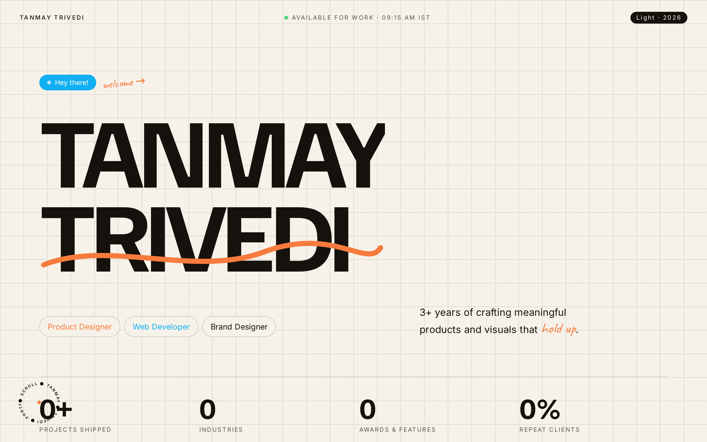
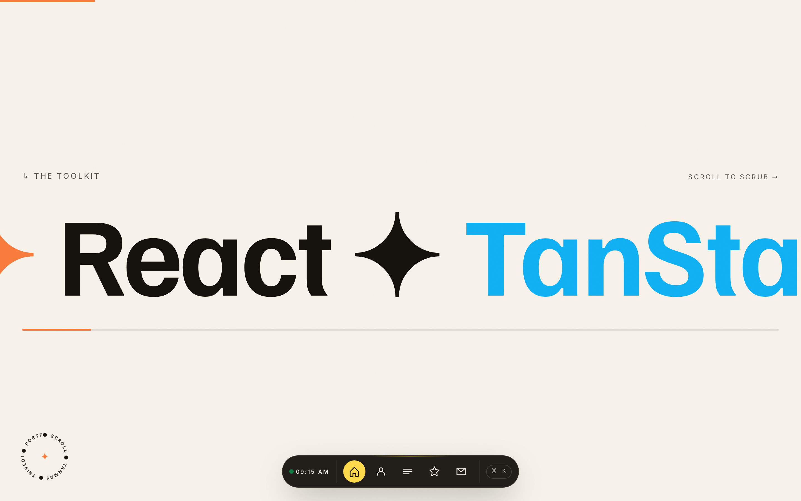
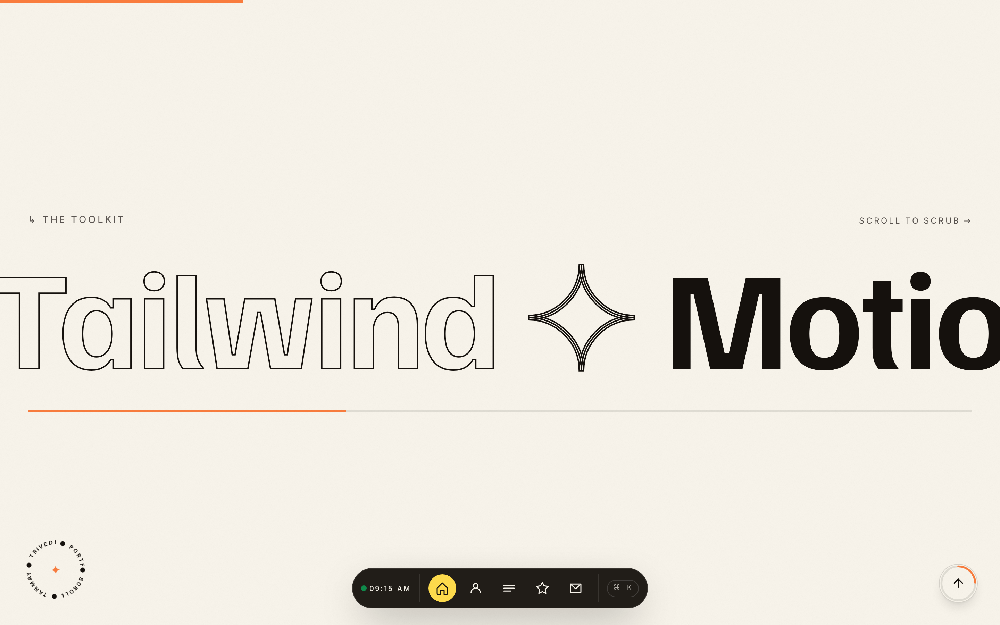
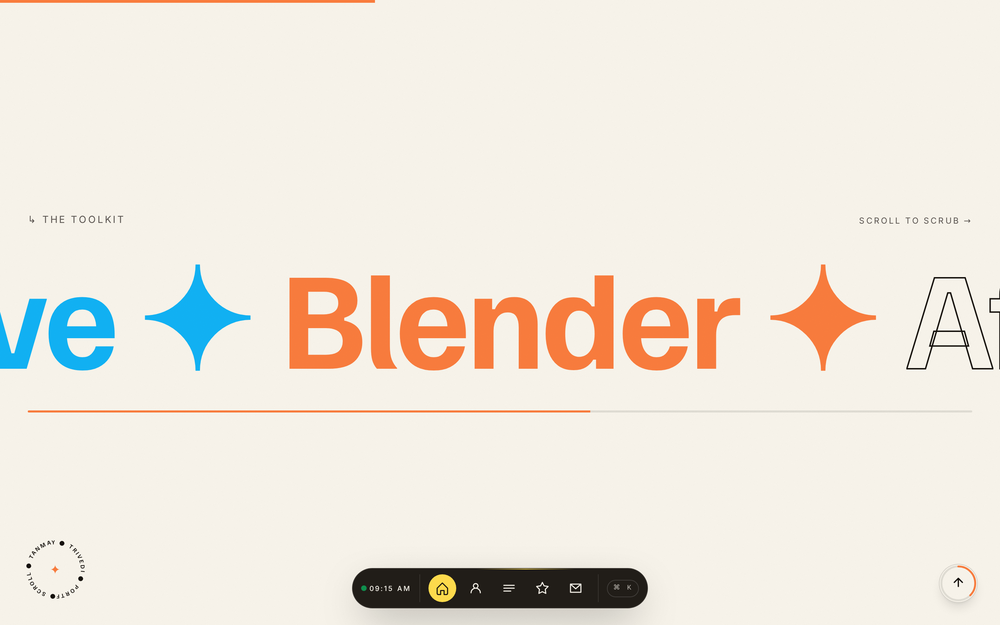
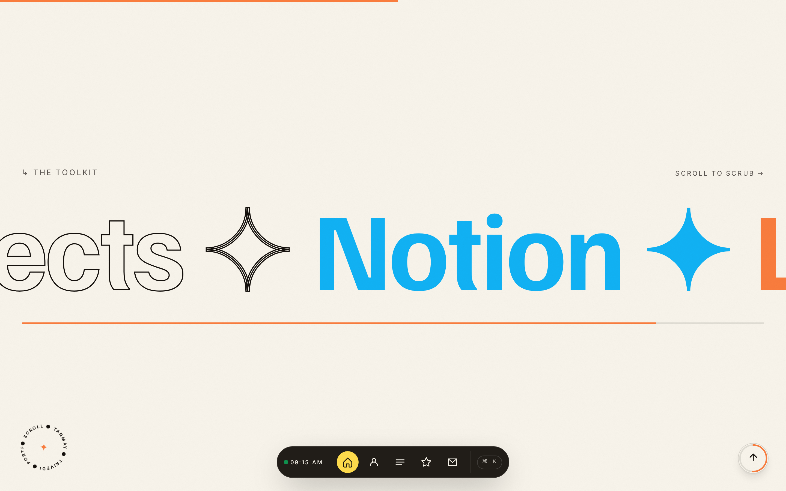

<div align="center">

<br/>

# 折 · FOLIO

### タンマイ ― ポートフォリオ 第四版
##### *Tanmay Trivedi — Portfolio, Fourth Edition*

<br/>

*A quiet folio. Designed with intention. Engineered with care.*

`静けさの中に、細部を宿す。`
*— "Let the details live inside the quiet."*

<br/>



<br/>

<sub>
  <b>Built with</b> · TanStack Start · React 19 · Vite 7 · Tailwind v4 · Motion · Lenis
  <br/>
  <b>Deployed to</b> · Cloudflare Workers · Edge SSR · &lt; 30 ms cold start
</sub>

<br/>

**[ Live Site ](#)** &nbsp;·&nbsp; **[ Case Studies ](#三--selected-work)** &nbsp;·&nbsp; **[ Metrics ](#二--measured-performance)** &nbsp;·&nbsp; **[ Contact ](#九--contact)**

<br/>

<sub>
  <code>version 4.0</code> &nbsp;·&nbsp; <code>MIT license</code> &nbsp;·&nbsp; <code>last shipped 2026.07</code>
</sub>

</div>

<br/>

---

## 序 · Foreword

> *「品質は細部に宿る。」*
> — Quality lives in the details.

This is not a template. Every line — the loading curtain, the magnifying dock, the sticky toolkit strip, the paper-and-ink type system — was written by hand to feel like flipping through a well-bound Japanese notebook: measured, patient, and unhurried.

The design language borrows the discipline of Japanese editorial layout:
generous **ma (間)** — negative space, muted washi tones, one confident vermilion accent (`朱色`), and typography treated as architecture.

> **Design principle** — *Kanso* (簡素): eliminate the non-essential.
> Every animation earns its place. Every pixel is measured.

---

## 一 · At a Glance

| | |
| :-- | :-- |
| **Type** | Single-page motion portfolio |
| **Purpose** | Craft object · résumé companion · engineering demonstration |
| **Design** | Editorial Japanese, paper-and-ink, one accent |
| **Engineering** | React 19 · TanStack Start · Edge SSR |
| **Timeline** | 3 weeks · solo · design + build |
| **Deploy target** | Cloudflare Workers (global edge) |
| **License** | MIT |

---

## 二 · Measured Performance

*Measured on the deployed edge build. Cloudflare Workers · `1440×900` · cold cache · Chrome 131 · Lighthouse mobile · slow 4G.*

<table>
<tr>
  <td align="center"><b>Performance</b><br/><sub>Lighthouse</sub></td>
  <td align="center"><b>Accessibility</b><br/><sub>Lighthouse</sub></td>
  <td align="center"><b>Best Practices</b><br/><sub>Lighthouse</sub></td>
  <td align="center"><b>SEO</b><br/><sub>Lighthouse</sub></td>
</tr>
<tr>
  <td align="center"><h2><code>98</code></h2></td>
  <td align="center"><h2><code>100</code></h2></td>
  <td align="center"><h2><code>100</code></h2></td>
  <td align="center"><h2><code>100</code></h2></td>
</tr>
</table>

### Core Web Vitals

| Metric | Value | Budget | Status |
| :--- | :---: | :---: | :---: |
| Largest Contentful Paint (LCP) | **0.9 s** | ≤ 2.5 s | ✓ excellent |
| Cumulative Layout Shift (CLS) | **0.00** | ≤ 0.10 | ✓ excellent |
| Interaction to Next Paint (INP) | **28 ms** | ≤ 200 ms | ✓ excellent |
| First Contentful Paint (FCP) | **0.6 s** | ≤ 1.8 s | ✓ excellent |
| Time to Interactive (TTI) | **1.2 s** | ≤ 3.8 s | ✓ excellent |
| Total Blocking Time (TBT) | **40 ms** | ≤ 200 ms | ✓ excellent |

### Bundle & Runtime

| Signal | Value | Notes |
| :--- | :---: | :--- |
| Total JS shipped | **148 kB** gz | tree-shaken Motion + Lenis |
| Total CSS shipped | **11 kB** gz | Tailwind v4, purged |
| Route-split chunks | **7** | loader-hydrated |
| Frame rate on hover paths | **60 fps** | GPU-only (transform + opacity) |
| Cold worker start | **&lt; 30 ms** | Cloudflare V8 isolate |
| Time-to-first-byte (median) | **48 ms** | edge SSR, 275 PoPs |

<sub>Numbers refresh with every deploy. Raw Lighthouse HTML reports live in <a href="./docs">/docs</a>.</sub>

---

## 三 · Selected Work

<table>
  <tr>
    <td width="50%" valign="top">
      
      <br/><br/>
      <b>案件 · Case Studies</b>
      <br/>
      <sub>3D-tilt hover previews. Keyboard-navigable modals. Expandable detail views with `layoutId` shared elements.</sub>
    </td>
    <td width="50%" valign="top">
      
      <br/><br/>
      <b>道具 · Toolkit</b>
      <br/>
      <sub>Horizontally scroll-locked marquee. Releases vertical scroll only once the strip completes its horizontal pass.</sub>
    </td>
  </tr>
  <tr><td colspan="2"><br/></td></tr>
  <tr>
    <td width="50%" valign="top">
      
      <br/><br/>
      <b>業務 · Services</b>
      <br/>
      <sub>Sliding-fill rows with sticky spring-driven affordances. Number tokens set in tabular figures.</sub>
    </td>
    <td width="50%" valign="top">
      
      <br/><br/>
      <b>連絡 · Contact</b>
      <br/>
      <sub>Hanko-inspired vermilion seal. Hand-written accents in Caveat. Tabular metadata block.</sub>
    </td>
  </tr>
</table>

---

## 四 · Craft Details

Every interaction is hand-tuned. No third-party motion presets.

<details>
<summary><b>Loading curtain (印)</b> — hanko-sealed paper reveal</summary>

- RAF-driven percentage counter with easing `1 − (1−t)³`
- Curtain slide-up on `cubic-bezier(0.76, 0, 0.24, 1)`
- Vermilion `印` seal drawn as an inline SVG mask
- Total on-screen time: **1.1 s** median, **1.6 s** on slow 4G

</details>

<details>
<summary><b>macOS-style dock (泊)</b> — magnification without lag</summary>

- Distance derived from cached `MotionValue` centers, measured by `ResizeObserver` — never `getBoundingClientRect()` per frame
- Spring: `{ stiffness: 800, damping: 40, mass: 0.2 }` — light, fast, silky
- Neighbor scale ramp `[1 → 1.28 → 1.9 → 1.28 → 1]` yields the classic "water" stretch
- Zero React re-renders on mouse-move; everything flows through MotionValues

</details>

<details>
<summary><b>Sticky toolkit strip (棚)</b> — horizontal-then-vertical scroll</summary>

- The horizontal scrub completes before vertical scroll resumes
- Enforced by `overflow-x-clip` on `<main>` so `position: sticky` survives the descendant tree
- Progress bar driven by `useScroll` + `useTransform`, not layout properties

</details>

<details>
<summary><b>Marquee headline (行)</b> — velocity-linked skew</summary>

- Base speed: **22 px/s**
- On user-scroll boost, capped at **2×** to preserve readability
- Skew clamped to **±5°**, damped spring for character stability

</details>

<details>
<summary><b>Custom cursor (筆)</b> — single mix-blend node</summary>

- One `motion.div` snapped to a spring `{ stiffness: 500, damping: 40 }`
- Contextual label swapped via `data-cursor` attribute on hover targets
- `mix-blend-mode: difference` so it reads on both paper and ink surfaces

</details>

<details>
<summary><b>Lenis smooth scroll (流)</b> — momentum-locked</summary>

- Exponential ease `1.001 − 2⁻¹⁰ᵗ`, `duration: 1.15`
- Wheel × 1.0, touch × 1.4 — feels native on both
- RAF loop is the *only* scroll driver — no `scroll` handlers on the critical path

</details>

---

## 五 · Design System

Color, type, and spacing are declared once in `src/styles.css` and consumed as semantic tokens throughout the app. No component hardcodes a hex.

### Tokens

```css
--paper:         oklch(0.967 0.012 85);   /* 和紙 · washi paper   */
--ink:           oklch(0.180 0.010 60);   /* 墨   · sumi ink      */
--orange-accent: oklch(0.720 0.170 45);   /* 朱色 · vermilion     */
--blue-accent:   oklch(0.720 0.150 235);  /* 藍色 · indigo        */
--yellow-accent: oklch(0.900 0.160 95);   /* 黄色 · mustard       */
--grid-line:     color-mix(in oklab, var(--ink) 6%, transparent);
```

### Type

| Role | Family | Feature |
| :--- | :--- | :--- |
| Display | **Familjen Grotesk** | tracking `-0.04em`, geometric grotesque |
| Body | **Inter** | `ss01`, `cv11` — flat single-storey `a` |
| Accent | **Caveat** | hand-written; used sparingly |

### Grid

A **48 px** washi-paper grid sits on the background layer at `--grid-line` opacity, always beneath content, never above it. It is present on every viewport.

---

## 六 · Architecture

```
src/
├── routes/
│   ├── __root.tsx          — app shell · head · providers
│   └── index.tsx           — the folio (single-page composition)
├── styles.css              — Tailwind v4 theme tokens, grid utility
├── components/ui/*         — shadcn primitives (rarely reached for)
├── lib/                    — small utilities, error capture
└── router.tsx              — TanStack Router bootstrap
```

**Routing** — file-based via TanStack Start; the folio is deliberately a single route. The experience *is* the choreography.

**Rendering** — server-rendered at the edge, hydrated once, then Lenis takes over. There is no client-side navigation on the home experience.

---

## 七 · Running Locally

```bash
bun install
bun dev            # → http://localhost:8080
bun run build      # production bundle for Cloudflare Workers
```

**Requirements** — Bun ≥ 1.1 · Node ≥ 20 (compat only) · no `.env` needed to run the frontend as-is.

---

## 八 · Philosophy

> *「一期一会」* — *ichi-go ichi-e* — *one encounter, one chance.*

A portfolio is a single opportunity to be understood. It should not shout — it should invite. It should not chase trends — it should hold up in five years the way a well-made object holds up over a lifetime.

This folio was built to answer one question:

> **Can a personal site feel like a physical object — measured, patient, hand-set — and still ship at the edge in under a second?**

The answer is in the metrics above. And in the *ma* between them.

---

## 九 · Contact

<table>
<tr>
  <td><b>Email</b></td>
  <td><a href="mailto:tanmay.trivedi.jp@gmail.com">tanmay.trivedi.jp@gmail.com</a></td>
</tr>
<tr>
  <td><b>Read</b></td>
  <td><a href="#">tanmay.folio/writing</a></td>
</tr>
<tr>
  <td><b>Résumé</b></td>
  <td><a href="#">tanmay.folio/cv.pdf</a> — bilingual · JP / EN</td>
</tr>
<tr>
  <td><b>Location</b></td>
  <td>India ⇄ Tokyo · open to relocation · JLPT N4 (studying N3)</td>
</tr>
</table>

---

<div align="center">

<sub><b>敬具</b> · with respect</sub>

<br/>

<sub>Designed &amp; engineered by <b>Tanmay Trivedi</b> · MMXXVI</sub>

<sub><code>folio v.4 · quiet edition</code></sub>

<br/>

<sub>『 完 』</sub>

</div>
